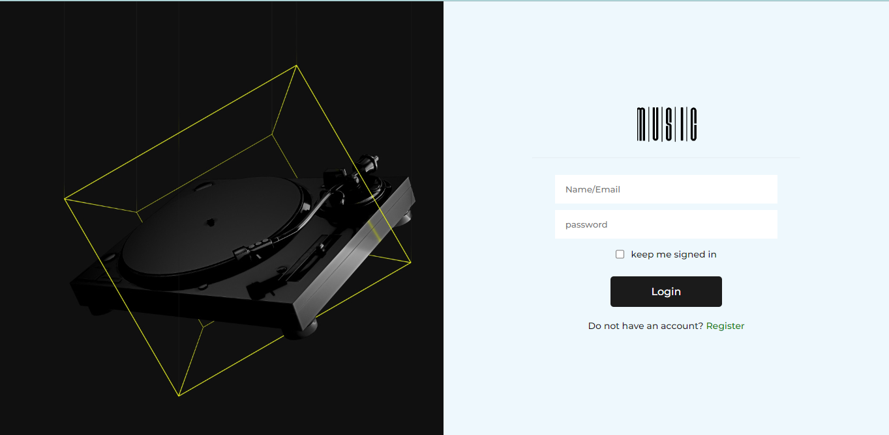
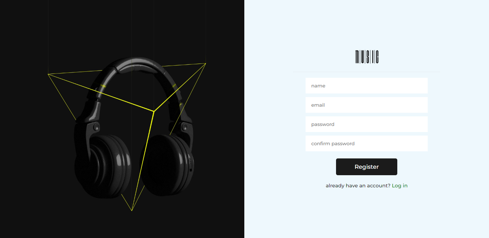
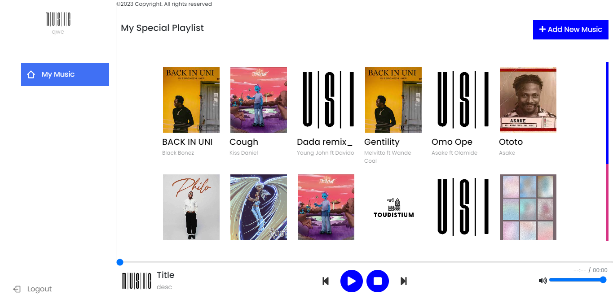

// create database called "mp_db" 
// import sql mp_db.sql in music_player -> database

// create database called "music" 
// import sql registration.sql in music_player -> database

// use qwe@gmail.com and "qwe" as password
//login page

//Registration page

//Dashboard

> [!WARNING]  
> Changed path to relative path.

